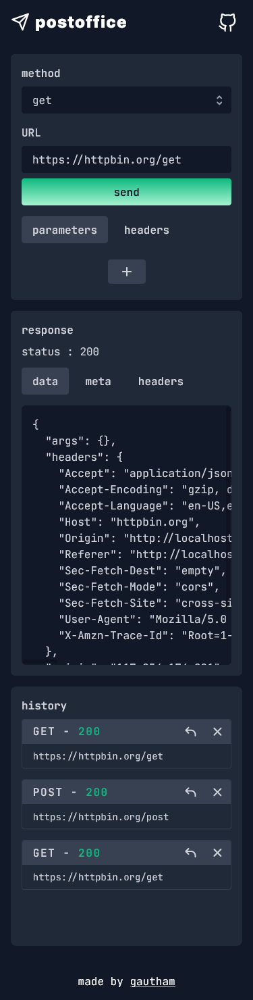

## **postoffice**  ⚡ 

🔗 [link](https://postoffice-api.netlify.app/)  
 

Working with 3rd party APIs can often be clunky. You know it, we know it. **postoffice** is a lightweight API playground that helps you interact with 3rd party APIs easily.

 Feature | Description
------- | -----------
🚀 **Make API requests** | make an API request to a 3rd party API from the UI. Common HTTP methods supported. The requests also supports sending HTTP headers and data in various formats if needed.
💻 **View API response** | view the formatted response. 
🔍 **History** | view and restore previos requests/responses.
💾 **Persistence** | user data is persisted locally.

 

### **Stack**
 - _reactJS_
 - _javaScript_
 - _tailwindcss_

### **roadmap**
- custom error responses and field validation.
- test coverage 
- better response type classification and formatting
- better response metadata
- include more _HTTP_ methods
- make requests with custom _cURL_ commands
- UI improvements with customisation features
- keyboard shortcuts
- convert into _PWA_ 

 

